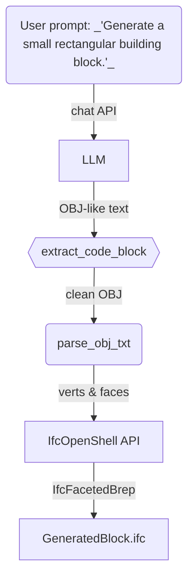

# 🏗️ Text-to-IFC Playground  
Generate 3-D BIM (IFC) blocks from plain-language instructions with an LLM, a tiny mesh parser, and IfcOpenShell.

---

## Table of Contents
1. [Why this exists](#why-this-exists)
2. [How it works (TL;DR)](#how-it-works-tldr)
3. [Repository layout](#repository-layout)
4. [Quick start](#quick-start)
5. [Detailed workflow](#detailed-workflow)
6. [Implementation decisions](#implementation-decisions)
7. [Limitations & future work](#limitations--future-work)
8. [References](#references)
9. [License](#license)

---

## Why this exists
> *“Can we ask ChatGPT for a *building* instead of a poem and open the result in Revit?”*

The small experiment in this repo shows **one** affordable way:

1. **LLM** (GPT-4o‐mini, or any chat-style model) → prompts back a **minimal OBJ mesh**.
2. Parse that mesh → vertices & faces.
3. **IfcOpenShell** → convert the mesh into an **IfcFacetedBrep** inside a valid IFC project.
4. Open the generated `*.ifc` in Revit / BlenderBIM / BIMcollab Zoom etc.

No training, no heavyweight geometry kernels, 100 lines of Python.

---

## How it works (TL;DR)

---

## Repository Layout
.
├─ examples/
│  ├─ obj_mess.txt        # raw LLM response
│  └─ parsed_mesh.txt     # extracted verts & faces
├─ src/
│  ├─ 01_prompt_llm.py    # prompt model & save response
│  ├─ 02_extract_code.py  # extract code block
│  ├─ 03_parse_mesh.py    # OBJ → Python lists
│  └─ 04_mesh_to_ifc.py   # lists → IFC file
├─ requirements.txt
└─ README.md              # you’re reading it
