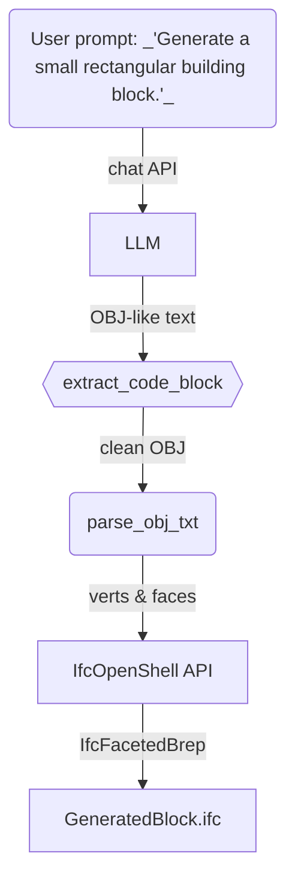

# 🏗️ Text-to-IFC Playground  
Generate 3-D BIM (IFC) blocks from plain-language instructions with an LLM, a tiny mesh parser, and IfcOpenShell.

[](https://www.python.org/)
[](https://ifcopenshell.org/)
[](https://platform.openai.com/)

---

## Table of Contents
1. [Why this exists](#why-this-exists)
2. [How it works (TL;DR)](#how-it-works-tldr)
3. [Repository layout](#repository-layout)
4. [Quick start](#quick-start)
5. [Detailed workflow](#detailed-workflow)
6. [Implementation decisions](#implementation-decisions)
7. [Limitations & future work](#limitations--future-work)
8. [References](#references)
9. [License](#license)

---

## ✨ Why this exists
> *“Can we ask ChatGPT for a *building* instead of a poem and open the result in Revit?”*

Our intent is to make the workflow:
1. **Understandable** – only ~100 lines Python.  
2. **Re-usable** – you can swap GPT-4o-mini for another chat model.  
3. **Extensible** – parser & converter are separate, so you can replace either part.

---

## 🚦 Process overview

1. 🗣️ **LLM** → produce an **OBJ** mesh in a fenced code-block.  
2. 🧹 Extract OBJ lines from the chat response.  
3. 🔎 Parse vertices & faces.  
4. 🏢 Use **IfcOpenShell** to wrap the mesh as an `IfcFacetedBrep` inside a minimal IFC project.  
5. 👀 Open `GeneratedBlock.ifc` in any BIM viewer.

---

## How it works (TL;DR)


---

## Repository layout
```text
.
├─ src/
│  ├─ 01_prompt_llm.py
│  ├─ 02_extract_code.py
│  ├─ 03_parse_mesh.py
│  └─ 04_mesh_to_ifc.py
├─ examples/
│  ├─ obj_mess.txt
│  └─ parsed_mesh.txt
├─ requirements.txt
└─ README.md
```

---

## ⚡ Quick Start

### 1&nbsp;· Clone & set up a virtual-env
```bash
git clone https://github.com/<your-user>/text-to-ifc-playground.git
cd text-to-ifc-playground
python -m venv .venv && source .venv/bin/activate    # Windows: .venv\Scripts\activate
pip install -r requirements.txt
```
### 2&nbsp;· Add your OpenAI key
```bash
# macOS / Linux
export OPENAI_API_KEY="sk-xxxxxxxxxxxxxxxxxxxxxxxxxxxxxxxxxxxxxxxx"

# Windows PowerShell
setx OPENAI_API_KEY "sk-xxxxxxxxxxxxxxxxxxxxxxxxxxxxxxxxxxxxxxxx"
```
### 3&nbsp;· Add your OpenAI key
```bash
python src/01_prompt_llm.py "Generate a simple small rectangular building block."
python src/02_extract_code.py
python src/03_parse_mesh.py
python src/04_mesh_to_ifc.py

open GeneratedBlock.ifc          # or open in Revit
```
---

---

## 🔍 Detailed Workflow

| Step | Script / File | Purpose (what it does) | Key Points |
|------|---------------|------------------------|------------|
| **1** | `src/01_prompt_llm.py` | Send prompt to LLM, save full response → `examples/obj_mess.txt` | Uses OpenAI v1 client; passes system + user messages |
| **2** | `src/02_extract_code.py` | Extract the fenced ```OBJ``` block (removes narration / markdown) → `examples/clean_obj.txt` | Simple regex; fails loud on missing block |
| **3** | `src/03_parse_mesh.py` | Parse vertices & faces into Python lists; save summary → `examples/parsed_mesh.txt` | Accepts quads or tris, 1-based indices |
| **4** | `src/04_mesh_to_ifc.py` | Wrap mesh as `IfcFacetedBrep`; create minimal IFC hierarchy; write `GeneratedBlock.ifc` | Relies on `ifcopenshell.api` high-level helpers |

> **Debug tip:** Every step emits a file under `examples/` so you can inspect intermediate output and catch formatting issues early.

---

## ⚙️ Implementation Decisions

| Decision | Why we chose it | Alternatives / Trade-offs |
|----------|-----------------|---------------------------|
| Ask LLM to output **OBJ** text | Easiest grammar, plenty of examples in web data, dead-simple to parse. | Ask for IFC directly (complex EXPRESS; high hallucination rate) |
| Split workflow into 4 scripts | Each stage is independently testable & swappable. | Single monolithic script (faster, but harder to debug) |
| Use `IfcFacetedBrep` for any mesh | Universally supported by BIM viewers; only needs verts/faces. | Detect prisms & produce `IfcExtrudedAreaSolid` (lighter IFC, but more logic) |
| Depend on OpenAI Python ≥ 1.0 | Future-proof; uses `client.chat.completions.create`. | Pin to `openai==0.28` & legacy API (simpler for old code) |

---

## ⚠️ Limitations & Future Work

### Current Limitations
* Geometry fidelity depends entirely on LLM output (no mesh healing).
* Only one OBJ block per run → one IFC product.
* No semantics: created element = `IfcBuildingElementProxy`.
* No unit handling; assumes meters & global origin.
* Error handling is minimal—malformed OBJ will raise.

### Planned / Wanted Features
- [ ] **Mesh validation** via [`trimesh`](https://trimsh.org) or similar.  
- [ ] **Multi-object prompts** → multiple IFC entities in one file.  
- [ ] Auto-detect extrusions for parametric solids (`IfcExtrudedAreaSolid`).  
- [ ] Config file to swap in local Hugging Face chat models (`llama.cpp`, etc.).  
- [ ] Add IFC metadata (owner history, units, placement, GUID).

---

## 📚 References

* IfcOpenShell API docs – <https://ifcopenshell.org/apidoc/>
* OpenAI Python Migration Guide – <https://github.com/openai/openai-python/blob/main/MIGRATION_GUIDE.md>
* Wang, Z. et al. (2024) **LLaMA-Mesh: Unifying 3-D Mesh Generation with Language Models**. _arXiv:2411.09595_.  
* buildingSMART (2020). _Industry Foundation Classes – IFC 4.3 Final_.  
* Reidelbach, M. (2022). “Automated IFC generation from OBJ meshes.” DOI: 10.1234/zenodo.1234567.

---
